# Design Document: App User Management Module

## Overview

本设计文档描述 App 用户管理模块的技术实现方案。该模块基于 Vue 3 + TypeScript 技术栈，复用项目现有的 NaTable、NaForm 等组件，实现 App 端用户、角色、菜单的管理功能。

模块采用与现有 `src/views/system/` 目录下相同的代码结构和设计模式，确保代码风格一致性。

**API 路径说明**: 项目的 axios 实例（`src/api/index.ts`）默认 baseURL 已包含 `/admin` 前缀，因此 API 函数中只需使用 `/app/user`、`/app/role`、`/app/menu` 等相对路径，实际请求会自动拼接为完整路径（如 `/admin/app/user/list`）。

## Architecture

```mermaid
graph TB
    subgraph "App User Management Module"
        subgraph "Views Layer"
            AppUser[App User Page<br/>src/views/app/user/User.vue]
            AppRole[App Role Page<br/>src/views/app/role/Role.vue]
            AppMenu[App Menu Page<br/>src/views/app/menu/Menu.vue]
        end
        
        subgraph "Config Layer"
            UserFormConfig[userFormConfig.ts]
            UserSearchConfig[userTableSearchFormConfig.ts]
            RoleFormConfig[roleDetailFormConfig.ts]
            RoleSearchConfig[roleTableSearchFormConfig.ts]
            MenuFormConfig[menuFormConfig.ts]
        end
        
        subgraph "API Layer"
            AppUserApi[src/api/appUser.ts]
            AppRoleApi[src/api/appRole.ts]
            AppMenuApi[src/api/appMenu.ts]
        end
    end
    
    subgraph "Shared Components"
        NaTable[NaTable Component]
        NaForm[NaForm Component]
        NaPageHeader[NaPageHeader Component]
    end
    
    subgraph "External"
        ArcoDesign[Arco Design Vue]
        Axios[Axios Request]
    end
    
    AppUser --> UserFormConfig
    AppUser --> UserSearchConfig
    AppUser --> AppUserApi
    AppUser --> AppRoleApi
    
    AppRole --> RoleFormConfig
    AppRole --> RoleSearchConfig
    AppRole --> AppRoleApi
    AppRole --> AppMenuApi
    
    AppMenu --> MenuFormConfig
    AppMenu --> AppMenuApi
    
    AppUser --> NaTable
    AppUser --> NaForm
    AppUser --> NaPageHeader
    
    AppRole --> NaTable
    AppRole --> NaForm
    AppRole --> NaPageHeader
    
    AppMenu --> NaForm
    AppMenu --> NaPageHeader
    
    NaTable --> ArcoDesign
    NaForm --> ArcoDesign
    
    AppUserApi --> Axios
    AppRoleApi --> Axios
    AppMenuApi --> Axios
```



## Components and Interfaces

### 1. API Layer

#### AppUser API (`src/api/appUser.ts`)

```typescript
import { request } from "./index";
import { z } from "zod";

// 用户状态枚举
export enum AppUserStatus {
    ENABLE = 1,
    DISABLE = 0,
}

// 用户数据类型
export const AppUserSchema = z.object({
    id: z.number(),
    username: z.string(),
    email: z.string().nullable(),
    phone: z.string().nullable(),
    nickname: z.string().nullable(),
    avatar: z.string().nullable(),
    status: z.number(),
    is_delete: z.boolean(),
    created_at: z.string(),
    updated_at: z.string(),
});
export type AppUser = z.infer<typeof AppUserSchema>;

// 创建用户 DTO
export const CreateAppUserSchema = z.object({
    username: z.string(),
    password: z.string(),
    email: z.string().nullable().optional(),
    phone: z.string().nullable().optional(),
    nickname: z.string().nullable().optional(),
    avatar: z.string().nullable().optional(),
    status: z.number().optional(),
    roles: z.array(z.number()).optional(),
});
export type CreateAppUserDto = z.infer<typeof CreateAppUserSchema>;

// 更新用户 DTO
export const UpdateAppUserSchema = z.object({
    id: z.number(),
    username: z.string().optional(),
    email: z.string().nullable().optional(),
    phone: z.string().nullable().optional(),
    nickname: z.string().nullable().optional(),
    avatar: z.string().nullable().optional(),
    status: z.number().optional(),
    roles: z.array(z.number()).optional(),
});
export type UpdateAppUserDto = z.infer<typeof UpdateAppUserSchema>;

// API 函数
export function getAppUserList(params: {
    username?: string;
    email?: string;
    phone?: string;
    status?: number;
    page: number;
    page_size: number;
});

export function getAppUser(id: number);
export function createAppUser(data: CreateAppUserDto);
export function updateAppUser(data: UpdateAppUserDto);
export function deleteAppUser(id: number);
export function resetAppUserPassword(id: number, password: string);
export function updateAppUserStatus(id: number, status: number);
export function getAppUserRoles(userId: number);
```

#### AppRole API (`src/api/appRole.ts`)

```typescript
import { request } from "./index";
import { z } from "zod";

// 角色状态枚举
export enum AppRoleStatus {
    ENABLE = "ENABLE",
    DISABLE = "DISABLE",
}

// 角色数据类型
export const AppRoleSchema = z.object({
    id: z.number(),
    name: z.string(),
    code: z.string(),
    description: z.string().nullable(),
    status: z.enum(["ENABLE", "DISABLE"]),
    created_at: z.string(),
    updated_at: z.string(),
});
export type AppRole = z.infer<typeof AppRoleSchema>;

// 创建角色 DTO
export const CreateAppRoleSchema = z.object({
    name: z.string(),
    code: z.string(),
    description: z.string().nullable().optional(),
    status: z.enum(["ENABLE", "DISABLE"]).optional(),
    menus: z.array(z.number()).optional(),
});
export type CreateAppRoleDto = z.infer<typeof CreateAppRoleSchema>;

// 更新角色 DTO
export const UpdateAppRoleSchema = z.object({
    id: z.number(),
    name: z.string().optional(),
    description: z.string().nullable().optional(),
    status: z.enum(["ENABLE", "DISABLE"]).optional(),
    menus: z.array(z.number()).optional(),
});
export type UpdateAppRoleDto = z.infer<typeof UpdateAppRoleSchema>;

// API 函数
export function getAppRoleList(params: {
    name?: string;
    code?: string;
    status?: string;
    page: number;
    page_size: number;
});

export function getAllAppRoles();
export function getAppRole(id: number);
export function createAppRole(data: CreateAppRoleDto);
export function updateAppRole(data: UpdateAppRoleDto);
export function deleteAppRole(id: number);
export function assignAppRoleUsers(roleId: number, userIds: number[]);
export function getAppRoleUsers(roleId: number);
export function assignAppRoleMenus(roleId: number, menuIds: number[]);
export function getAppRoleMenus(roleId: number);
```

#### AppMenu API (`src/api/appMenu.ts`)

```typescript
import { request } from "./index";
import { z } from "zod";

// 菜单类型枚举
export enum AppMenuType {
    Catalog = "Catalog",
    Page = "Page",
    Button = "Button",
}

// 菜单状态枚举
export enum AppMenuStatus {
    ENABLE = "ENABLE",
    DISABLE = "DISABLE",
}

// 菜单数据类型
export const AppMenuSchema = z.object({
    id: z.number(),
    pid: z.number().nullable(),
    title: z.string(),
    permission: z.string(),
    type: z.enum(["Catalog", "Page", "Button"]),
    path: z.string().nullable(),
    icon: z.string().nullable(),
    order: z.number(),
    status: z.enum(["ENABLE", "DISABLE"]),
    created_at: z.string(),
    updated_at: z.string(),
});
export type AppMenu = z.infer<typeof AppMenuSchema>;

// 菜单树节点类型
export interface AppMenuTreeNode extends AppMenu {
    children: AppMenuTreeNode[];
}

// 创建菜单 DTO
export const CreateAppMenuSchema = z.object({
    pid: z.number().nullable().optional(),
    title: z.string(),
    permission: z.string(),
    type: z.enum(["Catalog", "Page", "Button"]),
    path: z.string().nullable().optional(),
    icon: z.string().nullable().optional(),
    order: z.number().optional(),
    status: z.enum(["ENABLE", "DISABLE"]).optional(),
});
export type CreateAppMenuDto = z.infer<typeof CreateAppMenuSchema>;

// 更新菜单 DTO
export const UpdateAppMenuSchema = z.object({
    id: z.number(),
    pid: z.number().nullable().optional(),
    title: z.string().optional(),
    permission: z.string().optional(),
    type: z.enum(["Catalog", "Page", "Button"]).optional(),
    path: z.string().nullable().optional(),
    icon: z.string().nullable().optional(),
    order: z.number().optional(),
    status: z.enum(["ENABLE", "DISABLE"]).optional(),
});
export type UpdateAppMenuDto = z.infer<typeof UpdateAppMenuSchema>;

// API 函数
export function getAppMenuTree();
export function getAppMenuList();
export function getAppMenu(id: number);
export function createAppMenu(data: CreateAppMenuDto);
export function updateAppMenu(data: UpdateAppMenuDto);
export function deleteAppMenu(id: number);
export function assignMenuToRole(roleId: number, menuIds: number[]);
export function getMenusByRole(roleId: number);
```

### 2. View Layer

#### App User Page (`src/views/app/user/User.vue`)

页面结构：
- 页面头部：NaPageHeader 组件显示"App 用户管理"标题
- 主体区域：NaTable 组件展示用户列表
  - 工具栏：创建新用户按钮、导出按钮
  - 过滤表单：username、email、phone、status 搜索条件
  - 表格列：id、username、email、phone、nickname、avatar、status、created_at、操作
  - 操作列：修改、详情、重置密码、删除
- 弹窗：用户创建/编辑/详情表单弹窗

#### App Role Page (`src/views/app/role/Role.vue`)

页面结构：
- 页面头部：NaPageHeader 组件显示"App 角色管理"标题
- 主体区域：NaTable 组件展示角色列表
  - 工具栏：创建新角色按钮
  - 过滤表单：name、code、status 搜索条件
  - 表格列：id、name、code、description、status、created_at、操作
  - 操作列：详情、编辑、删除
- 弹窗：角色创建/编辑/详情表单弹窗，包含菜单权限树

#### App Menu Page (`src/views/app/menu/Menu.vue`)

页面结构：
- 页面头部：NaPageHeader 组件显示"App 菜单管理"标题
- 左侧区域：菜单树形列表，支持节点选择
- 右侧区域：菜单详情/编辑表单
  - 操作按钮：新增根菜单、增加子菜单、编辑、删除
  - 表单字段：title、permission、type、path、icon、order、status

### 3. Config Layer

#### User Form Config (`src/views/app/user/config/userFormConfig.ts`)

定义用户表单的输入项配置，包括：
- 新增用户表单项：username、password、email、phone、nickname、avatar、status、roles
- 编辑用户表单项：username、email、phone、nickname、avatar、status、roles
- 详情用户表单项：id、username、email、phone、nickname、avatar、status、created_at、updated_at、roles

#### User Search Config (`src/views/app/user/config/userTableSearchFormConfig.ts`)

定义用户列表搜索表单配置：
- 搜索字段：username、email、phone、status
- 表单布局配置

#### Role Form Config (`src/views/app/role/config/roleDetailFormConfig.ts`)

定义角色表单的输入项配置，包括：
- 新增角色表单项：name、code、description、status
- 编辑角色表单项：id、name、code、description、status
- 详情角色表单项：id、name、code、description、status、created_at、updated_at

#### Role Search Config (`src/views/app/role/config/roleTableSearchFormConfig.ts`)

定义角色列表搜索表单配置：
- 搜索字段：name、code、status
- 表单布局配置

#### Menu Form Config (`src/views/app/menu/config/menuFormConfig.ts`)

定义菜单表单的输入项配置，根据菜单类型（Catalog/Page/Button）和操作状态（Add/Edit/Detail）动态生成表单项。

## Data Models

### AppUser 数据模型

```typescript
interface AppUser {
    id: number;              // 用户ID
    username: string;        // 用户名
    email: string | null;    // 邮箱
    phone: string | null;    // 手机号
    nickname: string | null; // 昵称
    avatar: string | null;   // 头像URL
    status: number;          // 状态：1=启用，0=禁用
    is_delete: boolean;      // 是否删除
    created_at: string;      // 创建时间
    updated_at: string;      // 更新时间
}
```

### AppRole 数据模型

```typescript
interface AppRole {
    id: number;                        // 角色ID
    name: string;                      // 角色名称
    code: string;                      // 角色代码
    description: string | null;        // 描述
    status: 'ENABLE' | 'DISABLE';      // 状态
    created_at: string;                // 创建时间
    updated_at: string;                // 更新时间
}
```

### AppMenu 数据模型

```typescript
interface AppMenu {
    id: number;                              // 菜单ID
    pid: number | null;                      // 父菜单ID
    title: string;                           // 菜单标题
    permission: string;                      // 权限标识
    type: 'Catalog' | 'Page' | 'Button';     // 菜单类型
    path: string | null;                     // 路径
    icon: string | null;                     // 图标
    order: number;                           // 排序
    status: 'ENABLE' | 'DISABLE';            // 状态
    created_at: string;                      // 创建时间
    updated_at: string;                      // 更新时间
}

interface AppMenuTreeNode extends AppMenu {
    children: AppMenuTreeNode[];             // 子菜单
}
```


## Correctness Properties

*A property is a characteristic or behavior that should hold true across all valid executions of a system-essentially, a formal statement about what the system should do. Properties serve as the bridge between human-readable specifications and machine-verifiable correctness guarantees.*

基于 prework 分析，本模块主要是 UI 交互和 API 调用的前端页面，大部分验收标准适合用示例测试（单元测试/集成测试）覆盖。以下是可以用属性测试验证的核心属性：

### Property 1: 搜索过滤参数传递正确性

*For any* 搜索表单数据（包含 username、email、phone、status 等字段），当提交搜索时，API 请求参数应包含所有非空的搜索条件字段。

**Validates: Requirements 1.3, 5.3**

### Property 2: 用户角色数据传递完整性

*For any* 用户表单数据包含角色选择，当保存用户时，API 请求体中的 roles 字段应包含所有选中的角色 ID，且顺序和数量与用户选择一致。

**Validates: Requirements 4.2**

### Property 3: 菜单树数据结构正确性

*For any* 从 API 获取的菜单列表数据，转换为树形结构后，每个节点的 children 应只包含 pid 等于该节点 id 的子菜单，且不存在循环引用。

**Validates: Requirements 8.2**

### Property 4: 表单数据初始化正确性

*For any* 用户/角色/菜单记录，当打开编辑弹窗时，表单数据应与原始记录数据一致（除了需要转换的字段如角色 ID 数组）。

**Validates: Requirements 2.3, 6.3, 8.3**

## Error Handling

### API 错误处理

1. **网络错误**: 当 API 请求失败时，使用 Arco Design 的 Message 组件显示错误提示
2. **业务错误**: 当 API 返回业务错误码时，显示后端返回的错误信息
3. **表单验证错误**: 使用 NaForm 组件内置的验证机制，在提交前验证必填字段

### 用户操作错误处理

1. **删除确认**: 删除操作前使用 Popconfirm 组件进行二次确认
2. **表单取消**: 取消操作时重置表单数据到初始状态
3. **重复提交**: 在 API 请求期间禁用提交按钮，防止重复提交

### 数据加载错误处理

1. **列表加载失败**: 显示错误提示，提供重试按钮
2. **详情加载失败**: 关闭弹窗并显示错误提示
3. **角色/菜单列表加载失败**: 显示空选项并提示用户

## Testing Strategy

### 单元测试

使用 Vitest 进行单元测试，覆盖以下场景：

1. **API 函数测试**: 验证 API 函数正确调用 axios 并传递正确参数
2. **表单配置测试**: 验证表单配置项的正确性
3. **数据转换测试**: 验证菜单列表转树形结构的正确性

### 组件测试

使用 Vue Test Utils 进行组件测试，覆盖以下场景：

1. **页面渲染测试**: 验证页面正确渲染表格、表单等组件
2. **用户交互测试**: 验证点击按钮、提交表单等交互行为
3. **弹窗显示测试**: 验证弹窗的显示/隐藏逻辑

### 属性测试

使用 fast-check 进行属性测试，覆盖以下属性：

1. **Property 1**: 搜索过滤参数传递正确性
2. **Property 2**: 用户角色数据传递完整性
3. **Property 3**: 菜单树数据结构正确性
4. **Property 4**: 表单数据初始化正确性

每个属性测试配置最少 100 次迭代，使用随机生成的测试数据验证属性的普遍性。

### 测试文件结构

```
src/
├── api/
│   ├── __tests__/
│   │   ├── appUser.test.ts
│   │   ├── appRole.test.ts
│   │   └── appMenu.test.ts
├── views/
│   └── app/
│       ├── user/
│       │   └── __tests__/
│       │       └── User.test.ts
│       ├── role/
│       │   └── __tests__/
│       │       └── Role.test.ts
│       └── menu/
│           └── __tests__/
│               └── Menu.test.ts
```
